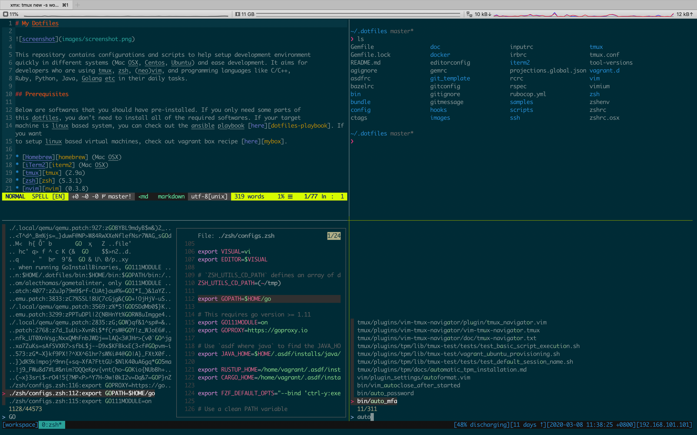

# My Dotfiles



This repository contains configurations and scripts to help setup development environment
quickly in different systems (Mac OSX, Centos, Ubuntu) and ease development. It aims for
developers who are using tmux, zsh, (neo)vim, and programming languages like C/C++,
Ruby, Python, Java, Golang etc in their daily tasks.

## Prerequisites

Below are softwares that you should have pre-installed. If you only need some parts of
this dotfiles, you don't need to install all of the required softwares. If your target
machine is linux based system, you can check out the ansible playbook [here][dotfiles-playbook]. If you want
to setup linux based virtual machines, check out vagrant box recipe [here][mybox].

* [Homebrew][homebrew] (Mac OSX)
* [iTerm2][iterm2] (Mac OSX)
* [tmux][tmux] (2.9a)
* [zsh][zsh] (5.3.1)
* [nvim][nvim] (0.3.8)

## Installation

Install `rcm` from https://github.com/thoughtbot/rcm, then execute below:

```sh
$ git clone https://github.com/uzxmx/dotfiles.git ~/.dotfiles
$ rcup
```

If you don't want to setup `asdf`, you can pass `SKIP_ASDF=1` to `rcup`. And later you can
run `./scripts/setup_asdf.sh` by yourself.

### Hooks

#### Pre-up hook

When executing `rcup`, `./hooks/pre-up` will firstly be executed. The script mainly does such things:

* Install dependencies
* Install `asdf`, its plugins, and packages (python/ruby/nodejs/java)

#### Post-up hook

When `rcup` finishes, `./hooks/post-up` will lastly be executed. The script mainly does such things:

* Generate configuration files from templates (`vim`, `coc`)
* Install `antibody`
* Install executables

## Setup nvim

When you execute `vi` for the first time, `vim-plug` will be automatically installed and then plugins
will also be installed. You can also use `:PlugInstall` to make sure plugins installed manually.

## Guidelines

For fast zsh loading, prefer to add commands under `bin/` directory, rather than in `zshrc` file. You
can use `benchmark_zsh_startup_time.sh` to check zsh startup time.

[dotfiles-playbook]: https://github.com/uzxmx/ansible_playbooks/blob/master/dotfiles.yml
[mybox]: https://github.com/uzxmx/boxes/blob/master/mybox/Vagrantfile
[homebrew]: http://brew.sh
[iterm2]: https://iterm2.com/
[tmux]: https://github.com/tmux/tmux
[zsh]: https://sourceforge.net/projects/zsh/
[nvim]: https://neovim.io/

## Some helpful dotfiles repos

* https://github.com/dhruvasagar/dotfiles
* https://github.com/Stratus3D/dotfiles
* https://github.com/joshukraine/dotfiles
* https://github.com/docwhat/dotfiles
* https://github.com/caarlos0/dotfiles
* https://github.com/paulirish/dotfiles
